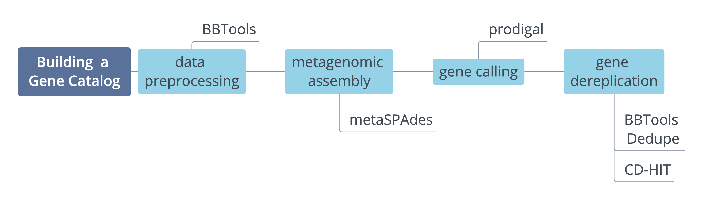
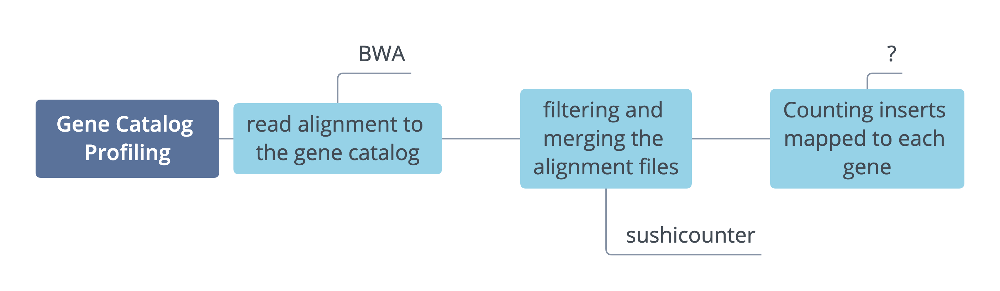
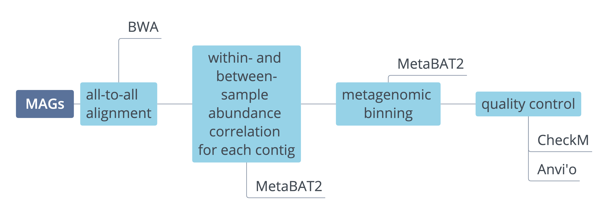

====================
Metagenome Assembly
====================

Technical advances in sequencing technologies in recent decades have allowed detailed investigation of complex microbial communities without the need for cultivation, which has proved to be challenging for many communities. Sequencing of microbial DNA extracted directly from environmental or host-associated samples have provided key information on microbial community composition. These studies have also allowed gene-level characterization of microbiomes as the first step to understanding the communities functional potential. Furthermore, algorithmic improvements as well as increased availability of computational resources make it now possible to reconstruct whole genomes from metagenomic samples (metagenome-assembled genomes (MAGs)). Methods for microbial community composition are discussed in :doc:`../profiling/metagenomes`. Here we describe building :ref:`Metagenomic Assembly` as well as building :ref:`Gene Catalogs` and :ref:`MAGs` from metagenomic data.

--------------------
Metagenomic Assembly
--------------------

.. image:: ../images/Metagenomic_Assembly_Overview.png

1. **Data Preprocessing**. Before proceeding to the assembly, it is important to preprocess the raw sequencing data. Standard preprocessing protocols are described in :doc:`../preprocessing/preprocessing`. In addition to standard quality control and adapter trimming, we also suggest normalization with **bbnorm.sh** and merging (see :doc:`../preprocessing/preprocessing` for more details).

2. **Metagenomic Assembly**. Following data preprocessing, we use clean reads to perform a metagenomic assembly using **metaSPAdes**. metaSPAdes is part of the SPAdes_ assembly toolkit. Following the assembly, we generate some assembly statistics using **assembly-stats**, and filter out contigs that are < 1 kbp in length. The script we use for contig filtering can be found here: :download:`contig_filter.py <../scripts/contig_filter.py>`.

.. _SPAdes: https://github.com/ablab/spades

    **Example command**:

    .. code-block:: console

        metaspades.py -t {threads} -m {memory} --only-assembler --pe1-1 <forward_reads.fq.gz> --pe1-2 \
        <reverse_reads.fq.gz> --pe1-s <singeltons.fq.gz> --pe-1m <merged_reads.fq.gz> -o <output_directory>

**Options Explained**

=====================     =====================================================================================================
``-t``                     Number of threads
``-m``                     Set memory limit in Gb; spades will terminate if that limit is reached
``--only-assembler``       Run assembly module only (spades can also perform read error correction, this step will be skipped)
``--pe-1``                 Forward reads
``--pe1-2``                Reverse reads
``--pe1-s``                Unpaired reads
``--pe-1m``                Merged reads
``-o``                     Specify output directory
=====================     =====================================================================================================

**Example Command for filtering and stats**:

  .. code-block:: console

      python contig_filter.py {params.sample} contigs {sample/contigs.fasta.gz {params.workfolder}/{params.sample}
      assembly-stats -l 500 -t <(zcat {sample.min500.fasta.gz) > {sample}.assembly.stats

.. note::

    **Computational Resources**: Metagenomic assembly requires a lot of memory (usually > 100 Gb).
    You can use multiple threads (16-32) to speed up the assembly.

3. The metagenomic contigs generated in step 2 can now be used to build and/or profile :ref:`Gene Catalogs` or to construct :ref:`MAGs`.

--------------
Gene Catalogs
--------------

Gene catalog generation and profiling (i.e. gene abundance estimation) can provide important insights into the community's structure, diversity and functional potential. This analysis could also identify relationships between genetic composition and environmental factors as well as disease associations.

.. note:: Integrated catalogs of reference genes have been generated for many ecosystems (<add link to ocean>, <add link to human gut>) and might be a good starting point for the analysis.

Creation
^^^^^^^^

This protocol will allow you to create a de novo gene catalog from your metagenomic samples.

1. **Gene calling**. We use **prodigal** to extract protein-coding genes from metagenomic assemblies (usually uses **contigs** as input). Prodigal has different gene prediction modes with single genome mode as default. To run prodigal on metagenomic mode we add the ``-p meta`` option. This will produce a fasta file with amino acid sequences (.faa), nucleotide sequences (.fna) as well as an annotation file (.gff).

    **Example command**:

    .. code-block:: console

        zcat {in.fa.gz} | prodigal -a {out.faa} -d {out.fna} -f gff -o {out.gff} -c -q -p meta

**Options Explained**

=========    =====================================================================================================
``-a``           Specify protein translations file
``-d``           Specify nucleotide sequences file
``-f``           Specify output format: gbk: Genbank-like format (Default); gff: GFF format; sqn: Sequin feature table format; sco: Simple coordinate output
``-o``           Specify output file, default stdout
``-c``           Closed ends, do not allow partial genes at edges of sequence
``-q``           Run quietly (suppress logging output)
``-p``           Specify mode: normal: Single genome, any number of sequences (Default); train: Do only training. Input should be multiple FASTA of one or more closely related genomes; anon: Anonymous sequences, analyze using preset training files, ideal for metagenomic data or single short sequences.
=========    =====================================================================================================

2. **Gene de-replication**. The next step is to remove duplicated sequences from the catalog. Called genes are de-replicated at 95% identity and 90% coverage of the shorter gene using a combination of BBTools Dedupe_ and CD-HIT_.

.. _Dedupe: https://jgi.doe.gov/data-and-tools/bbtools/bb-tools-user-guide/dedupe-guide/

.. _CD-HIT: https://github.com/weizhongli/cdhit/wiki

    **Example command: de-replication**:

    .. code-block:: console

        dedupe.sh -Xmx500G in={in.fasta} out={out.rep.fasta} outd={out.red.fasta} \
        threads=64 absorbrc=f exact=t touppercase=t usejni=t ac=t mergenames=t absorbmatch=t; \

**Options Explained**

================    =====================================================================================================
``-Xmx500G``         To force a program to use 500 G of RAM
``usejni``           Set to true (t) to enable JNI-accelerated versions of BBMerge, BBMap, and Dedupe. Requires the C code to be compiled.
``in``               A single file or a comma-delimited list of files
``out``              Destination for all output contigs
``outd``             Optional; removed duplicates will go here
``threads``          Number of worker threads to spawn, default is number of logical processors
``absorbrc``         Set to true (t) to absorb reverse-complements as well as normal orientation
``exact``            Set to true (t) to only allow exact symbol matches; when false (f), an 'N' will match any symbol
``touppercase``      Set to true (t) to convert lowercase letters in reads to upper case
``ac``               Set to true (t) to absorb full containments of contigs
``mergenames``       Set to true (t) to concatenate respective headers when a sequence absorbs another
``absorbmatch``      Set to true (t) to absorb exact matches of contigs
================    =====================================================================================================

    **Example command: clustering**:

    .. code-block:: console

        cd-hit-est -i {out.rep.fasta} -o {out.fasta} -c 0.95 -T 64 \
        -M 0 -G 0 -aS 0.9 -g 1 -r 0 -d 0

**Options Explained**

=========    =====================================================================================================
``-i``           Input filename in fasta format, required
``-o``           Output filename, required
``-c``           Sequence identity threshold, default 0.9 (this is the default cd-hit's "global sequence identity" calculated as: number of identical amino acids in alignment divided by the full length of the shorter sequence
``-T``           Number of threads, default 1; with 0, all CPUs will be used
``-M``           Memory limit (in MB) for the program, default 800; 0 for unlimitted
``-G``           Use global sequence identity, default 1; if set to 0, then use local sequence identity, calculated as: number of identical amino acids in alignment divided by the length of the alignment NOTE!!! don't use -G 0 unless you use alignment coverage controls (e.g. options -aS)
``-aS``          Alignment coverage for the shorter sequence, default 0.0; if set to 0.9, the alignment must cover 90% of the sequence
``-g``           1 or 0, default 0; by cd-hit's default algorithm, a sequence is clustered to the first cluster that meets the threshold (fast cluster); if set to 1, the program will cluster it into the most similar cluster that meets the threshold (accurate but slow mode); either 1 or 0 won't change the representatives of final clusters
``-r``           1 or 0, default 1; by default do both +/+ & +/- alignments; if set to 0, only +/+ strand alignment
``-d``           length of description in .clstr file, default 20; if set to 0, it takes the fasta defline and stops at first space
=========    =====================================================================================================

.. important::

    There is an additional step that picks the longest sequence and updates the clustering file for dedupe. Need to ask Hans. Also at which point do you combine samples? after gene calling?

Profiling
^^^^^^^^^

This protocol allows quantification of genes in a gene catalog for each metagenomic sample.

1. **Read alignment**. In the first step the (cleaned) sequencing reads are mapped back to the gene catalog using BWA_ aligner. Note that forward, reverse, singlton and merged reads are mapped separately and are then filtered and merged in the later step.

.. _BWA: https://github.com/lh3/bwa

    **Example Command**:

.. code-block::

    bwa mem -a -t {threads} {in.gc.fasta} {in.r1.fq.gz} | samtools view -F 4 -bh - > {out.r1.bam}
    bwa mem -a -t {threads} {in.gc.fasta} {in.r2.fq.gz} | samtools view -F 4 -bh - > {out.r2.bam}
    bwa mem -a -t {threads} {in.gc.fasta} {in.s.fq.gz} | samtools view -F 4 -bh - > {out.s.bam}
    bwa mem -a -t {threads} {in.gc.fasta} {in.m.fq.gz} | samtools view -F 4 -bh - > {out.m.bam}

**Options Explained**

==============    =====================================================================================================
``bwa mem``            Align 70bp-1Mbp query sequences with the BWA-MEM algorithm, the algorithm works by seeding alignments with maximal exact matches (MEMs) and then extending seeds with the affine-gap Smith-Waterman algorithm (SW)
``-a``                 Output all found alignments for single-end or unpaired paired-end reads, these alignments will be flagged as secondary alignments
``-t``                 Number of threads
samtools view      Views and converts SAM/BAM/CRAM files
``-F *FLAG*``          Do not output alignments with any bits set in *FLAG* present in the FLAG field; *FLAG* can be specified in hex by beginning with `0x' (i.e. /^0x[0-9A-F]+/), in octal by beginning with `0' (i.e. /^0[0-7]+/), as a decimal number not beginning with '0' or as a comma-separated list of flag names
``-b``                 Output in the BAM format
``-h``                 Include the header in the output
==============    =====================================================================================================

.. important::
    These are not up to date! TBD

2. **Filtering the alignment files**.
3. **Counting gene abundance**.

-----
MAGs
-----

The Holy Grail of metagenomics is to be able to assemble individual microbial genomes from complex community samples. However assemblies with short read assemblers fails to reconstruct complete genomes. For that reason, binning approaches have been developed to facilitate creation of Metagenome Assembled Genomes (MAGs).

The first steps (Steps 1 through 3) are the same for MAGs as for :ref:`Gene Catalogs` workflow. This workflow starts with size-filtered metaSPAdes assembled contigs.

1. **All-to-all Alignment**. In this step, quality controlled for each of the metagenomic samples is mapped to each of the metagenomic assemblies using BWA. Map reads from all samples against scaffolds in each other sample. Here we use -a to allow mapping to secondary sites.

    **Example Command**:

    .. code-block:: console

        bwa

.. important::

    **Computational Resources**: !

The generated alignment files are then filtered to only include alignments that are at least 45 nucleotides long, with an identity of >= 97 and covering 80 of the read sequence. The alignment filtering was done using ... Other alternatives?

    **Example Command**:

    .. code-block:: console

        sushicounter

2. **Within- and between-sample abundance correlation for each contig**.

    **Example Command**:

    .. code-block:: console

        metaBAT2

.. note::

    How many samples do I need to benefit?
    Strictly speaking need at least 3, with as few as 20 starting to see improvement in the assemblies

3. **Metagenomic Binning**

    **Example Command**:

    .. code-block:: console

        metaBAT2

4. **Quality Control**. Quality checks: CheckM adn Anvi'o

    Quality Metrics

Taxonomic/Functional annotations -> page for that

Further Reading
^^^^^^^^^^^^^^^
`MetaBat2 Wiki <https://bitbucket.org/berkeleylab/metabat/wiki/Best%20Binning%20Practices>`_

Alternative workflow: low abundance metagenome/pooled assembly
^^^^^^^^^^^^^^^^^^^^^^^^^^^^^^^^^^^^^^^^^^^^^^^^^^^^^^^^^^^^^^
