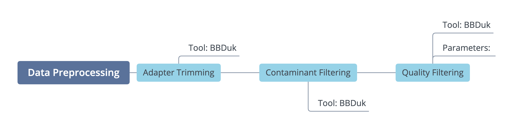

===================
Data Preprocessing
===================

-----------------------
General Considerations
-----------------------

Data quality control is an essential first step in any bioinformatics workflow. Below we discuss recommended preprocessing steps for **short read Illumina** sequencing data. Broadly, these steps involve Illumina adapter removal, contaminant filtering and quality-trimming. Additional preprocessing steps, recommended only for specific workflows, are detailed in :ref:`Other Considerations`.

.. important::

    This applies to (standard) Illumina short read data. Long read sequencing data from other technologies, or other library preparations from Illumina (ex. Nextera Mate Pair Reads data) will require a different preprocessing protocol.

1.  **Adapter Trimming**. The adapter sequences contain the sequencing primer binding sites, index sequences, and sequences that allow flow-cell binding. Unless removed, these can interfere with downstream analyses. For this and other preprocessing steps, we use  `BBTools <https://jgi.doe.gov/data-and-tools/bbtools/bb-tools-user-guide/>`_, a set of tools developed by the Joint Genome Institute. Adapter trimming is performed using `BBDuk <https://jgi.doe.gov/data-and-tools/bbtools/bb-tools-user-guide/bbduk-guide/>`_. In this step, a FASTA file with Illumina adapter sequences is specified as reference, and BBDuk will perform k-mer matching to trim the adapter sequences from the reads. The example command is shown below.

    **Example command**
        .. code-block:: console

            bbduk.sh -Xmx1G usejni=t in=<forward_reads> in2=<reverse_reads> \
            out=<forward_trimmed_reads> out2=<reverse_trimmed_reads> \
            outm=<reads_that_fail_filters> outs=<output_singletons>  \
            refstats=<adapter_trimming_stats> statscolumns=5 overwrite=t ref=<input_adapters_fasta> \
            ktrim=r k=23 mink=11 hdist=1  2>> <log_file>

**Options Explained**

========    =========================================================================================================
-Xmx1G      sets a limit on memory (?)
usejni=t    makes it faster?
ktrim=r     trim the adapter, as well as all the bases to the right of the adapter sequence
k=23        length of the k-mer used for matching
mink=11     additionally match shorter k-mers (with lengths between 23 and 11) to trim partial adapter sequences
hdist=1     hamming distance for reference k-mers
========    =========================================================================================================

.. note::

    `Why are adapter sequences trimmed from only the 3' ends of reads? <https://emea.support.illumina.com/bulletins/2016/04/adapter-trimming-why-are-adapter-sequences-trimmed-from-only-the--ends-of-reads.html>`_

2. **Contaminant removal**. Spike-ins (most commonly PhiX) are usually used for quality control of sequencing runs, as well as to ensure nucleotide diversity when sequencing low complexity libraries. These sequences should not be present in your data, but we perform this filtering step prior to downstream analysis to be completely sure. Here we also use BBDuk. However, a PhiX genome is provided as the reference.

    **Example command**

    .. code-block:: console

        bbduk.sh -Xmx1G usejni=t in=<forward_reads> in2=<reverse_reads> \
        out=<forward_filtered_reads> out2=<reverse_filtered_reads> \
        outm=<output_phix_matched> outs=<output_phix_singletons> \
        ref=<phix_fasta> k=31 hdist=1 refstats=<phix_stats> statscolumns=5 2>> {log.log}

**Options Explained**

The command is very similar to the one shown above.

.. note::

    PhiX and low complexity libraries. High nucleotide diversity (i.e. equal relative proportions of A,C,G, and T in each cycle) is critical to the performance of Illumina sequencers. Low diversity (or low complexity libraries) libraries, such as amplicon libraries, will have a large proportion on one nucleotide and small proportion of other nucleotides in a cycle. To compensate for low complexity, a PhiX DNA sequence is often added to the library. Different sequencers use different chemistry and image processing software, and require different amounts of PhiX spike-in (anywhere between 5% and 50%). Check the latest information about your sequencing platform.

3. **Quality filtering and trimming**. In this step we use BBDuk to trim low quality bases from the ends of the reads, and filter reads based on length, average read quality, and number of Ns present.

    **Example command**

    .. code-block:: console

        bbduk.sh -Xmx1G usejni=t in=<forward_fastq> in2=<reverse_fastq>  \
        fastawrap=10000 out1={output.fq1_clean} out2={output.fq2_clean} \
        outm={output.qc_failed} outs={output.qc_singletons} minlength=45 \
        qtrim=rl maq=20 maxns=1  stats={output.qc_stats} statscolumns=5 trimq=14  2>> {log.log};

**Options Explained**

=============    ==========================================================
minlength=45     filter out reads that are shorter than 45 bp
qtrim=rl         trim low quality bases on the right and left ends of the reads
trimq=14         regions with average quality BELOW 14 will be trimmed
maq=20           filter out reads with average quality BELOW 20
maxns=1          filter out reads with more than 1 N
=============    ==========================================================

.. note::

    Base quality scores (i.e. level of confidence for any one base call) are an integral part of many bioinformatics pipelines (i.e. alignment and variant calling). Quality scores are usually expressed on a Phred scale (:math:`Q=-log_{10}P`, where P is the probability of an error in the base call). Base quality scores normally ranged somewhere between 2 and 40, where  Q40 represents an error probability of 1/10000.  More recently, Illumina started using binned quality scores. For example, NovaSeq (with RTA3) only produces 4 Q-scores: 2 is assigned to no-calls, 12 to calls <Q15, 23 to ~Q20 and 37 to >Q30. According to Illumina and in our hands, these binned quality scores did not affect the downstream analyses (i.e. variant calling).

All of the preprocessing commands can be piped together as follows:

.. code-block:: console

    bbduk.sh -Xmx1G pigz=t bgzip=f usejni=t in=<forward_fastq> in2=<reverse_fastq> \
    out=stdout.fq outm=<output_adapter_matched> outs=<output_adapter_singletons>  \
    refstats=<output_adapter_stats> statscolumns=5 overwrite=t ref=<input.adapters> \
    ktrim=r k=23 mink=11 hdist=1  2 >> <log_file> | \
    bbduk.sh -Xmx1G usejni=t pigz=t bgzip=f interleaved=true overwrite=t \
    in=stdin.fq out=stdout.fq outm={output.phix_matched} outs={output.phix_singletons} \
    ref={input.phix} k=31 hdist=1 refstats={output.phix_stats} statscolumns=5 2>> {log.log} | \
    bbduk.sh -Xmx1G pigz=t bgzip=f usejni=t overwrite=t interleaved=true \
    in=stdin.fq fastawrap=10000 out1={output.fq1_clean} out2={output.fq2_clean} \
    outm={output.qc_failed} outs={output.qc_singletons} minlength={params.minlen} \
    qtrim=rl maq={params.maq} maxns=1  stats={output.qc_stats} statscolumns=5 trimq={params.trimq}  2>> {log.log};

--------------------
Other Considerations
--------------------

========================    ==============================================  ===========
 **Preprocessing Step**               **Recommended for**                    **Tools**
========================    ==============================================  ===========
Paired-read merging         Metagenomic assembly, 16S and mOTUs profiling
Coverage normalization      Metagenomic assembly
Filtering out host reads    Any samples containing host DNA
========================    ==============================================  ===========

Filtering out host reads
^^^^^^^^^^^^^^^^^^^^^^^^

    **Example Command**
    .. code-block::

        bbmap.sh -Xmx23g usejni=t threads=20 overwrite=t qin=33 minid=0.95 maxindel=3 bwr=0.16 bw=12 quickmatch fast \
        minhits=2 path={human_bbmap_ref} qtrim=rl trimq=15 untrim in1={in.1.fq.gz} in2={in.2.fq.gz} outu1={out.1.fq.gz} \
        outu2={out.2.fq.gz} outm={out.human.matched.fq.gz} 2>> {out.rmHuman.log}

        # This step has to be repeated for singleton sequences generated in the QC step:

        bbmap.sh -Xmx23g usejni=t threads=24 overwrite=t qin=33 minid=0.95 maxindel=3 bwr=0.16 bw=12 quickmatch fast    minhits=2 \
        path={human_bbmap_ref} qtrim=rl trimq=15 untrim in={in.s.fq.gz} outu={out.s.fq.gz} outm={out.s.human.matched.fq.gz} 2>> {out.rmHuman.log}

Normalization
^^^^^^^^^^^^^

Pair-read Merging
^^^^^^^^^^^^^^^^^
