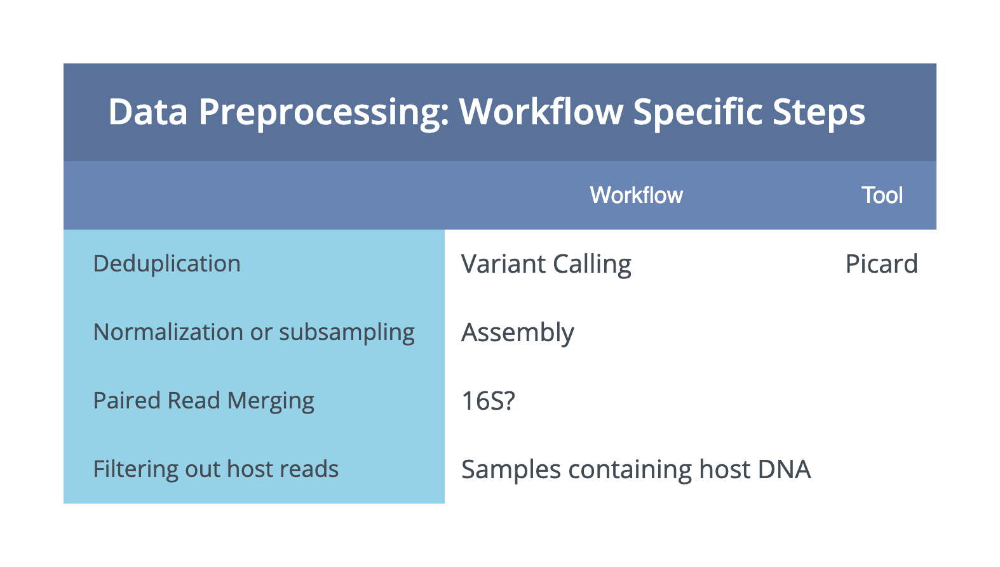

===================
Data Preprocessing
===================

-----------------------
General Considerations
-----------------------

Data quality control and preprocessing is an essential first step to any bioinformatic workflow. Below we discuss current preprocessing steps we recommend for **short read Illumina** sequencing data. Broadly, these steps involve Illumina adapter removal, contaminant filtering and quality-trimming. Additional preprocessing steps, recommended only for specific workflows are detailed in :ref:`Other Considerations`.

.. important::

    This applies to (standard) Illumina short read data. Long read sequencing data from other technologies, or other library preparataions from Illumina (ex. Nextera Mate Pair Reads data) will require a different preprocessing protocol.

.. image:: ../images/Preprocessing.png

1.  **Adapter Trimming**. The adapter sequences contain the sequencing primer binding site, index sequences, and sequences that allow flow-cell binding. Unless removed, these can interfere with downstream analyses. For this and other preproccessing we use Joint Genome Institute developed set of tools `BBTools <https://jgi.doe.gov/data-and-tools/bbtools/bb-tools-user-guide/>`_. *Write something about how it workds*. Adpater trimming is perfomed using **BBDuk**. The example command is show below.

    - *-Xmx1G* sets a limit on memory (?)
    - *usejni=t* ? makes it faster?
    - *ktrim=r* will trim the bases that match the adapter, as well as all the bases to the right of the adapter sequence
    - *k=23* length of the k-mer used for matching
    - *mink=11* additionally look for shorter k-mers (length 23 to 11)
    - *hdist=1* hamming distance for reference k-mers

    **Example command**
        .. code-block:: console

            bbduk.sh -Xmx1G usejni=t in=<forward_fastq> in2=<reverse_fastq> \
            out=<forward_trimmed_fastq> out2=<reverse_trimmed_fastq> \
            outm=<reads_that_fail_filters> outs=<output_adapter_singletons>  \
            refstats=<output_adapter_stats> statscolumns=5 overwrite=t ref=<input.adapters> \
            ktrim=r k=23 mink=11 hdist=1  2>> <log_file>

.. note::

    `Why do we only trim adapters on the 3' ends? <https://emea.support.illumina.com/bulletins/2016/04/adapter-trimming-why-are-adapter-sequences-trimmed-from-only-the--ends-of-reads.html>`_

2. Contaminant removal.

    **Example command**

    .. code-block:: console

        bbduk.sh -Xmx1G usejni=t pigz=t bgzip=f interleaved=true overwrite=t \
        in=stdin.fq out=stdout.fq outm={output.phix_matched} outs={output.phix_singletons} \
        ref={input.phix} k=31 hdist=1 refstats={output.phix_stats} statscolumns=5 2>> {log.log}

3. Quality filtering.
    **Example command**

    .. code-block:: console

        bbduk.sh -Xmx1G pigz=t bgzip=f usejni=t overwrite=t interleaved=true \
        in=stdin.fq fastawrap=10000 out1={output.fq1_clean} out2={output.fq2_clean} \
        outm={output.qc_failed} outs={output.qc_singletons} minlength={params.minlen} \
        qtrim=rl maq={params.maq} maxns=1  stats={output.qc_stats} statscolumns=5 trimq={params.trimq}  2>> {log.log};

.. note::

    `Illumina binned quality scores <https://www.illumina.com/documents/products/whitepapers/whitepaper_datacompression.pdf>`_. `NovaSeq Quality Scores <https://emea.illumina.com/content/dam/illumina-marketing/documents/products/appnotes/novaseq-hiseq-q30-app-note-770-2017-010.pdf>`_.

.. code-block:: console

    bbduk.sh -Xmx1G pigz=t bgzip=f usejni=t in=<forward_fastq> in2=<reverse_fastq> \
    out=stdout.fq outm=<output_adapter_matched> outs=<output_adapter_singletons>  \
    refstats=<output_adapter_stats> statscolumns=5 overwrite=t ref=<input.adapters> \
    ktrim=r k=23 mink=11 hdist=1  2 >> <log_file> | \
    bbduk.sh -Xmx1G usejni=t pigz=t bgzip=f interleaved=true overwrite=t \
    in=stdin.fq out=stdout.fq outm={output.phix_matched} outs={output.phix_singletons} \
    ref={input.phix} k=31 hdist=1 refstats={output.phix_stats} statscolumns=5 2>> {log.log} | \
    bbduk.sh -Xmx1G pigz=t bgzip=f usejni=t overwrite=t interleaved=true \
    in=stdin.fq fastawrap=10000 out1={output.fq1_clean} out2={output.fq2_clean} \
    outm={output.qc_failed} outs={output.qc_singletons} minlength={params.minlen} \
    qtrim=rl maq={params.maq} maxns=1  stats={output.qc_stats} statscolumns=5 trimq={params.trimq}  2>> {log.log};

--------------------
Other Considerations
--------------------

------------------
Further Reading
------------------

