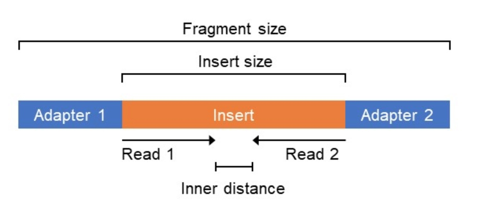
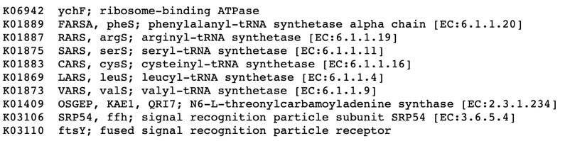
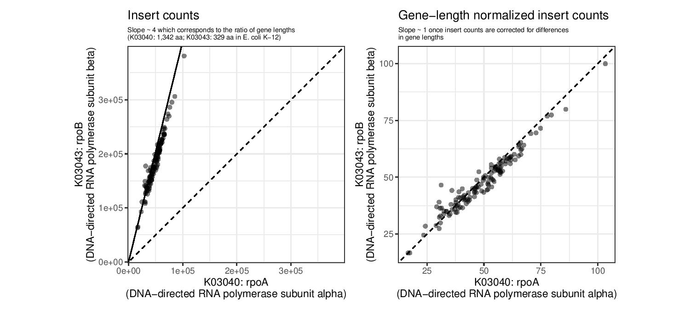
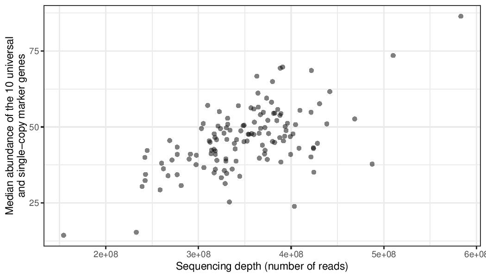
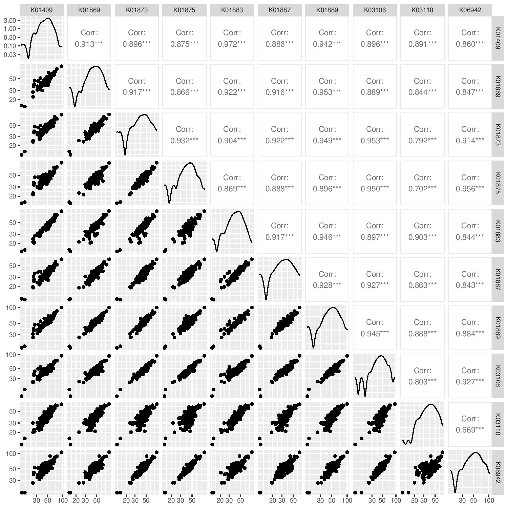
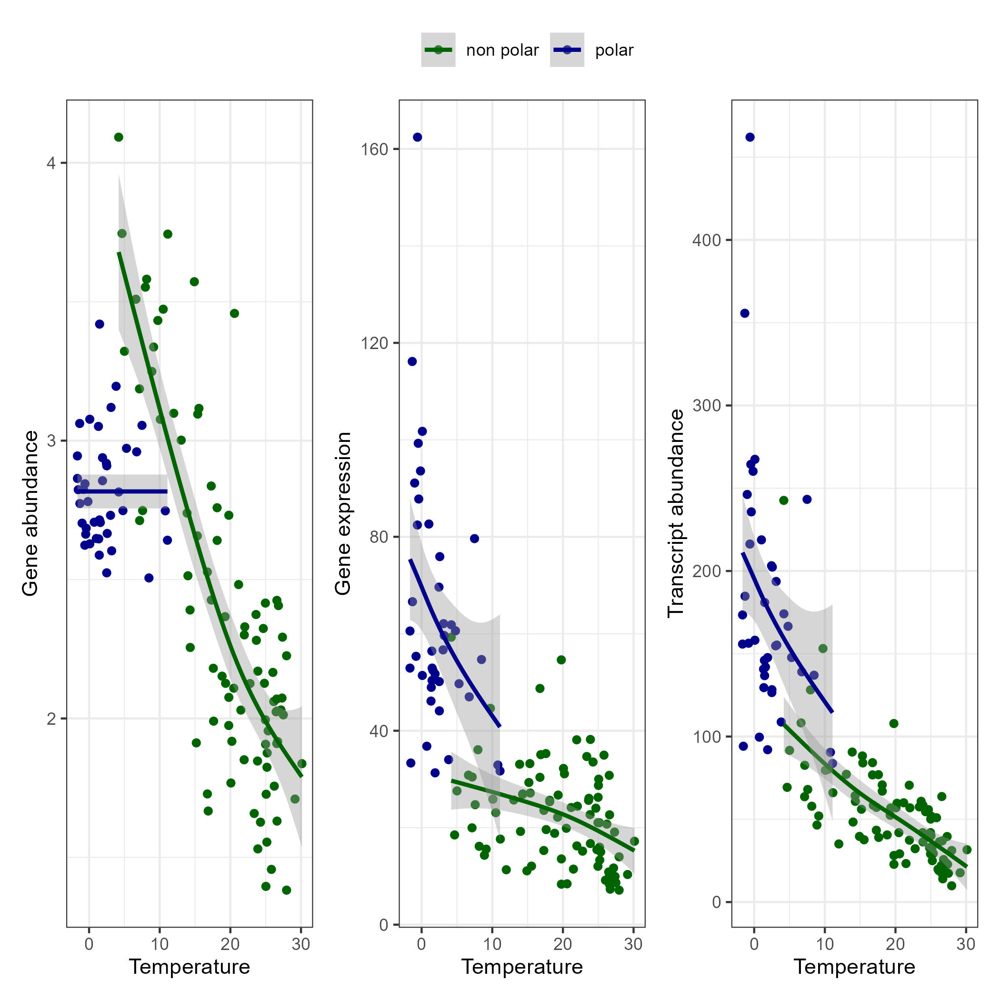

=====================
Metatranscriptomics
=====================

Protocol provided by Guillem Salazar.

-----------------------
Introduction
-----------------------
Metatranscriptomics is the analysis of all of the transcriptomes present in a sample and is an effective method to assess the activity of a microbial community. Unlike :doc:`metagenomic data <../assembly/metagenomic_workflows>`, metatranscriptomics can help decipher the metabolic functions actively expressed by the community at any given time.

- Advantages: 

  - Best way to get information about community activity

- Disadvantages:

  - Sample preparation might be difficult and expensive
  - Data analysis methods are not well established

Metatrancriptomic experiments can be broadly summarised into 2 different types: experiments that include matching metagenomic samples and those that do not. The analysis of these two datatypes are different.

-------------------------------------------------------------
Metatranscriptomics & Metagenomics
-------------------------------------------------------------

Dataset
-----------------------------------------
In this documentation we will combine metatranscriptomics with metagenomics by using a genome as a reference for the transcriptome. In order to do this, metagenomic data was used as described in :doc:`gene catalog creation <../assembly/metagenomic_workflows>` to create a gene catalog. The **metagenomic data** was then mapped back to the gene catalog to determine **gene abundance**. And the **metatranscriptomic data** from each sample was then mapped to the gene catalog to determine **transcript abundance**. Gene functional annotation into orthologous groups can then be performed using eggNOG.

.. mermaid:: 

.. note:: 

    Transcript abundance depends on both gene abundance (number of genes) and expression level (number of mRNAs per gene). See `Figure S1 <https://www.sciencedirect.com/science/article/pii/S009286741931164X#figs1>`_ for more information.

.. note::

    Unannotated genes (-1 fraction) were used to generate de novo gene clusters for further functional characterization of the catalog.

The dataset used in this tutorial is from the article `Gene Expression Changes and Community Turnover Differentially Shape the Global Ocean Metatranscriptome, Salazar et al <https://doi.org/10.1016/j.cell.2019.10.014>`_.
The data can be downloaded :download:`here <../downloads/metatranscriptomics_tutorial.zip>`.

This will contain the following files: .... 

Data Normalisation
-------------------

For both gene abundance and transcript abundance data, we must remove the following sources of bias:

* Differences in gene length between genes.
* Differences in sequencing depth between samples.
* Differences in genome size distribution between samples.
* Compositionality: The number of inserts for a given gene in a given sample is in itself arbitrary and can only be interpreted relative to the rest of the genes in the sample. @Lilith provide reference that explains compositionality. @Anna, I got this from Guillem's presentation and I cannot find any reference that also uses this term in this context.

.. note:: 

  @Lilith/Guillem Explain genome size differences between samples

.. mermaid::

   flowchart LR
        id1( Normalisation) --> id2(gene length normalisation)
        id2 --> id3(sequencing depth normalisation)
        id3 --> id4(per cell/ normalisation)
        classDef tool fill:#96D2E7,stroke:#F8F7F7,stroke-width:1px;
        style id1 fill:#5A729A,stroke:#F8F7F7,stroke-width:1px,color:#fff
        class id2,id3,id4 tool

Setting up R environment and loading the data
^^^^^^^^^^^^^^^^^^^^^^^^^^^^^^^^^^^^^^^^^^^^^

We perform all of the normalisation steps in R. To run this analysis you will need `tidyverse` and `data.table` libraries.

.. code-block:: r

    library(data.table)
    library(tidyverse)
    # To read compressed files data.table needs R.utils library
    library(R.utils)  

Next we are going to load gene and transcript abundances: Both are in the file `metat_metag_test_profile.csv.gz`. The file `metat_metag_test_meta.csv.gz` contains metadata about the samples (i.e. location, depth, and environmental conditions).

.. code-block:: r

  # Load the gene and transcript abundances 

    profile <- fread("metat_metag_test_profile.csv.gz", sep = ",",
                     header = T, data.table = F, tmpdir = ".")

    sample_info <- fread("metat_metag_test_meta.csv.gz", sep = ",",
                         header = T, data.table = F, tmpdir = ".")

Gene length normalisation
^^^^^^^^^^^^^^^^^^^^^^^^^
The first step in the normalisation process is to divide the insert counts by the gene length for each gene in each sample. Since the **unmapped (-1)** fraction does not have a length, we assign it the median gene length.

.. note::

  Inserts are genomic sequences that correspond to one or two reads. Therefore, the insert counts are counts of DNA molecules.

.. code-block:: r
    

    profile[1:4]%>% tail(1)

    if (length(which(profile$length < 0)) > 0){
      med_length = median(profile$length[which(profile$length > 0)])
      profile$length[which(profile$length < 0)] <- med_length
    }

    profile[1:4] %>% tail(1)

    # Build a gene-length normalized profile
    
    profile_lengthnorm <- profile %>% 
                          mutate_if(is.numeric, function(x){x / profile$length})

    # Or:
    # @Guillem, why for loop? Because of the data size?
    profile_lengthnorm <- profile[, 1:4]
    for (i in 5:ncol(profile)){
      cat("Normalizing by gene length: sample", colnames(profile)[i], "\n")
      tmp <- profile[, i]/profile$length %>%
        as.data.frame()
      colnames(tmp) <- colnames(profile)[i]
      profile_lengthnorm <- profile_lengthnorm %>%
        bind_cols(tmp)
    }

Sequencing depth, per cell normalisation and compositionality
^^^^^^^^^^^^^^^^^^^^^^^^^^^^^^^^^^^^^^^^^^^^^^^^^^^^^^^^^^^^^

To account for differences in sequencing depth, as well as for differences in genome sizes between different samples, we normalize the gene and transcript abundance data by abundances of **10 marker genes**.

.. note:: 

  What are marker genes (MGs)?

    * Universal: present in "all" prokaryotes
    * Single-copy: always present once per cell (genome)
    * Are housekeeping genes

Because of these characteristics, their abundance should correlate well with the sequencing depth. In addition, the median abundance of MGs is a good proxy for the number of cells captured in a given metagenomic/metatranscriptomic sample. The per-cell normalization should account for differences in genome sizes between samples, and the per-cell normalization also controls for compositionality. The result of this normalisation is a biologically meaningful unit: *gene copies per total cell in the community*.

To normalize by abundance of 10 MGs, we first compute their total insert count in each sample (i.e. sum the counts for each of the 10 KOs). We then compute the median of the 10 MGs in each sample. Finally, we divide the gene-length normalized abundances by this median for each sample.

In this example we use the following marker genes:

.. code-block:: r

    # Define the KOs corresponding to the 10 MGs
    mgs <- c("K06942", "K01889", "K01887", "K01875", "K01883", 
             "K01869", "K01873", "K01409", "K03106", "K03110")

    # Build a MGs normalized profile

    profile_lengthnorm_mgnorm <- profile_lengthnorm[, 1:4]
    for (i in 5:ncol(profile_lengthnorm)){
      cat("Normalizing by 10 MGs: sample", colnames(profile_lengthnorm)[i], "\n")
      mg_median <- profile_lengthnorm %>%
        select(KO, abundance = all_of(colnames(profile_lengthnorm)[i])) %>%
        filter(KO %in% mgs) %>%
        group_by(KO) %>% summarise(abundance = sum(abundance)) %>%
        ungroup() %>% summarise(mg_median = median(abundance)) %>%
        pull()
      tmp <- profile_lengthnorm[, i] / mg_median
      tmp <- tmp %>% as.data.frame()
      colnames(tmp) <- colnames(profile_lengthnorm)[i]
      profile_lengthnorm_mgnorm <- profile_lengthnorm_mgnorm %>%
        bind_cols(tmp)
    }

    # Save profiles and compress
    fwrite(profile_lengthnorm, "gene_profile_tara_lengthnorm.tsv", sep = "\t")
    gzip("gene_profile_tara_lengthnorm.tsv")
    fwrite(profile_lengthnorm_mgnorm, "gene_profile_tara_lengthnorm_percell.tsv", sep = "\t")
    gzip("gene_profile_tara_lengthnorm_percell.tsv")

@Anna This will need to be reworked since only using a subset of data. Or might want to provide those pre-calculated.
-----------------------------------------
Showing the effect of the normalization
-----------------------------------------
Here, we visualize the effect of the normalization based on length and abundance of marker genes. Using this script we create the following plots:

.. code-block:: r

    library(data.table)
    library(tidyverse)
    library(patchwork)
    library(GGally)
    library(R.utils)

    # Define the KOs corresponding to the 10 MGs
    mgs <- c("K06942", "K01889", "K01887", "K01875", "K01883", "K01869", "K01873", "K01409", "K03106", "K03110")

    # Load the raw count and gene length normalized profiles and the sample information
    gc_profile <- fread("gene_profile_tara.tsv.gz", sep = "\t", header = T, data.table = F, tmpdir = ".")
    gc_profile_lengthnorm <- fread("gene_profile_tara_lengthnorm.tsv.gz", sep = "\t", header = T, data.table = F, tmpdir = ".")
    sample_info <- fread("sample_info_tara.tsv", sep = "\t", header = T, data.table = F, tmpdir = ".")

    # Compute the abundance of K03040 and K03043 with and without gene-length normalization
    rp_ab <- gc_profile %>%
      select(-reference, -length, -Description) %>%
      filter(KO %in% c("K03040", "K03043")) %>%
      pivot_longer(-KO, names_to = "sample", values_to = "inserts") %>%
      filter(sample %in% sample_info$sample_metag) %>%
      group_by(KO, sample) %>% summarise(inserts = sum(inserts)) %>%
      pivot_wider(names_from = "KO", values_from = "inserts")

    rp_ab_lengthnorm <- gc_profile_lengthnorm %>%
      select(-reference, -length, -Description) %>%
      filter(KO %in% c("K03040", "K03043")) %>%
      pivot_longer(-KO, names_to = "sample", values_to = "inserts_lengthnorm") %>%
      filter(sample %in% sample_info$sample_metag) %>%
      group_by(KO, sample) %>% summarise(inserts_lengthnorm = sum(inserts_lengthnorm)) %>%
      pivot_wider(names_from = "KO", values_from = "inserts_lengthnorm")

    g1 <- ggplot(data = rp_ab, aes(x = K03040, y = K03043)) +
      geom_point(alpha = 0.5) +
      geom_abline(slope = (1342/329)) +
      geom_abline(linetype = 2) +
      xlim(range(rp_ab$K03040, rp_ab$K03043)) +
      ylim(range(rp_ab$K03040, rp_ab$K03043)) +
      xlab("K03040: rpoA\n(DNA-directed RNA polymerase subunit alpha)") +
      ylab("K03043: rpoB\n(DNA-directed RNA polymerase subunit beta)") +
      labs(title = "Insert counts", subtitle = "Slope ~ 4 which corresponds to the ratio of gene lengths\n(K03040: 1,342 aa; K03043: 329 aa in E. coli K-12)") +
      coord_fixed() +
      theme_bw() +
      theme(plot.subtitle = element_text(size = 7))
    g2 <- ggplot(data = rp_ab_lengthnorm, aes(x = K03040, y = K03043)) +
      geom_point(alpha = 0.5) +
      geom_abline(linetype = 2) +
      xlim(range(rp_ab_lengthnorm$K03040, rp_ab_lengthnorm$K03043)) +
      ylim(range(rp_ab_lengthnorm$K03040, rp_ab_lengthnorm$K03043)) +
      xlab("K03040: rpoA\n(DNA-directed RNA polymerase subunit alpha)") +
      ylab("K03043: rpoB\n(DNA-directed RNA polymerase subunit beta)") +
      labs(title = "Gene-length normalized insert counts", subtitle = "Slope ~ 1 once insert counts are corrected for differences\nin gene lengths") +
      coord_fixed() +
      theme_bw() +
      theme(plot.subtitle = element_text(size = 7))
    g <- g1 | g2
    ggsave("K03040_K03043_comparison.pdf", g, width = unit(10, "cm"), height = unit(4.5, "cm"))

    # Compute the abundance of the 10MGs and correlate to sequencing depth
    mgs_ab_lengthnorm <- gc_profile_lengthnorm %>%
      select(-reference, -Description, -length) %>%
      filter(KO %in% mgs) %>%
      pivot_longer(-KO, names_to = "sample", values_to = "inserts_lengthnorm") %>%
      group_by(KO, sample) %>% summarise(inserts_lengthnorm = sum(inserts_lengthnorm)) %>%
      ungroup() %>% group_by(sample) %>% summarise(median_mgs = median(inserts_lengthnorm)) %>%
      inner_join(sample_info, by = c("sample" = "sample_metag"))

    g3 <- ggplot(data = mgs_ab_lengthnorm, aes(x = sample_metag_nreads, y = median_mgs)) +
      geom_point(alpha = 0.5) +
      #geom_smooth(method = "lm") +
      #scale_x_log10() +
      #scale_y_log10() +
      xlab("Sequencing depth (number of reads)") +
      ylab("Median abundance of the 10 universal\nand single-copy marker genes") +
      theme_bw() +
      theme(legend.title = element_blank())

    ggsave("mgs_vs_seqdepth.pdf", g3, width = unit(7, "cm"), height = unit(4, "cm"))

    # Compute the abundance of the 10MGs and their autocorrelation
    mgs_ab_lengthnorm <- gc_profile_lengthnorm %>%
      select(-reference, -Description, -length) %>%
      filter(KO %in% mgs) %>%
      pivot_longer(-KO, names_to = "sample", values_to = "inserts_lengthnorm") %>%
      group_by(KO, sample) %>% summarise(inserts_lengthnorm = sum(inserts_lengthnorm)) %>%
      inner_join(sample_info, by = c("sample" = "sample_metag")) %>%
      select(KO, sample, inserts_lengthnorm) %>%
      pivot_wider(names_from = "KO", values_from = "inserts_lengthnorm")

    g4 <- ggpairs(data = mgs_ab_lengthnorm %>% column_to_rownames("sample")) +
      scale_x_log10() +
      scale_y_log10()

    ggsave("mgs_pairwise_corr.pdf", g4, width = unit(10, "cm"), height = unit(10, "cm"))

-----------------------------------------
Combining Metatranscriptomic and Metagenomic Data
-----------------------------------------

In this section we combine metatranscriptomic and metagenomic data and create the following plot:

.. code-block:: r

    library(data.table)
    library(tidyverse)
    library(patchwork)
    library(GGally)
    library(R.utils)

    # Load normalized profile
    gc_profile <- fread("gene_profile_tara_lengthnorm_percell.tsv.gz", sep = "\t", header = T, data.table = F, tmpdir = ".")
    sample_info <- fread("sample_info_tara.tsv", sep = "\t", header = T, data.table = F, tmpdir = ".")

    # Build a KO profile by adding up all genes with the same KO annotation
    ko_profile <- gc_profile %>%
      group_by(KO) %>% summarise(across(starts_with("TARA"), sum)) %>%
      as.data.frame()

    # Compute the gene abundance, transcript abundance and expression for the pairs of metaG-metaT samples
    # The expression is just the ratio of transcript_abundance to gene_abundance
    tmp_sample_info <- sample_info %>%
      select(sample_metag, sample_metat) %>%
      mutate(sample_pair = paste(sample_metag, sample_metat, sep = "-"))
    tmp_metag <- ko_profile %>%
      select(KO, all_of(tmp_sample_info$sample_metag)) %>%
      pivot_longer(-KO, names_to = "sample_metag", values_to = "gene_abundance")
    tmp_metat <- ko_profile %>%
      select(KO, all_of(tmp_sample_info$sample_metat)) %>%
      pivot_longer(-KO, names_to = "sample_metat", values_to = "transcript_abundance")
    final_profile <- tmp_sample_info %>%
      left_join(tmp_metag, by = "sample_metag") %>%
      left_join(tmp_metat, by = c("KO", "sample_metat")) %>%
      mutate(expression = transcript_abundance/gene_abundance)

    # Plot the gene abundance, expression and transcript abundance of K03704: cspA: cold shock protein
    toplot <- final_profile %>%
      filter(KO == "K03704") %>%
      left_join(sample_info, by = c("sample_metag","sample_metat"))

    g_metat <- ggplot(data = toplot, aes(y = transcript_abundance, x = `temperature [°C]`, color = depth_layer)) +
      geom_point() +
      geom_smooth(method = "gam", se = T) +
      #scale_y_log10() +
      #coord_flip() +
      scale_color_manual(values = c("darkgreen", "darkblue")) +
      ylab("Transcript abundance") +
      theme_bw() +
      theme(legend.position = "none")
    g_metag <- ggplot(data = toplot, aes(y = gene_abundance, x = `temperature [°C]`, color = depth_layer)) +
      geom_point() +
      geom_smooth(method = "gam", se = T) +
      #scale_y_log10() +
      #coord_flip() +
      scale_color_manual(values = c("darkgreen", "darkblue")) +
      ylab("Gene abundance") +
      theme_bw() +
      theme(legend.position = "none")
    g_exp <- ggplot(data = toplot, aes(y = expression, x = `temperature [°C]`, color = depth_layer)) +
      geom_point() +
      geom_smooth(method = "gam", se = T) +
      #scale_y_log10() +
      #coord_flip() +
      scale_color_manual(values = c("darkgreen", "darkblue")) +
      ylab("Gene expression") +
      theme_bw() +
      theme(legend.position = "top", legend.title = element_blank())
    g <- g_metag | g_exp | g_metat
    ggsave("K03704.pdf", g)

-------------------------------------------------------------
Metatranscriptomics without Metagenomics (Defined community)
-------------------------------------------------------------
Metatranscriptomic data arising from defined communities (i.e. community, whose composition is known) can be analysed in a way similar to traditional RNASeq with a few key differences. In this case, we first map the quality-controlled reads to the bacterial genomes, and then count number of reads mapping to each feature. The statistical analysis to identify differentially expressed features can be performed using DESeq2 [ref].

.. mermaid::

  flowchart LR
          id1(Preprocessing the genome) --> id2(create metagenome fa:fa-cog cat)
          id2 --> id3(genome index fa:fa-cog bowtie2)
          classDef tool fill:#96D2E7,stroke:#F8F7F7,stroke-width:1px;
          style id1 fill:#5A729A,stroke:#F8F7F7,stroke-width:1px,color:#fff
          class id2,id3 tool

.. mermaid:: 
  flowchart LR
        id1(RNAseq) --> id2(Genome alignment fa:fa-cog bowtie2)
        id2 --> id3(Insert counting fa:fa-cog featureCounts)
        id3 --> id4(Statistical/ analysis fa:fa-cog DESeq2)
        classDef tool fill:#96D2E7,stroke:#F8F7F7,stroke-width:1px;
        style id1 fill:#5A729A,stroke:#F8F7F7,stroke-width:1px,color:#fff
        class id2,id3,id4 tool

Preprocessing the genomes
^^^^^^^^^^^^^^^^^^^^^^^^^
1. First we create a `metagenome`, i.e. a concatenation of genome sequences for all of the organisms present in the community. We also need to create a combined annotation file (`gff`). This will be needed later on to count how many reads mapped to each gene.

.. note:: 
  Why competitive mapping is important. Properly accounts for sequences that potentially map to multiple targets/species (multimappers, count as fractions). If the sample was mapped to each species individually, these reads will be counted towards each genome, overestimating the counts

.. code::

  cat species1.fasta species2.fasta > metagenome.fasta

2. Build genome index. This is an essential step before any read alignment step regardless of aligner you choose. Here we use bowtie2 

.. code:: 

  bowtie2-build metagenome.fasta metagenome

Transcript profiling
^^^^^^^^^^^^^^^^^^^^
3. (Optional) Depending on the library preparation strategy, metatranscriptomic samples can contain large amounts of rRNA. You can use `fastqc_screen` to assess amount of rRNA in your samples, and sortmerna[] to filter out 

3. Next we align reads from each sample to our indexed metagenome. 

.. code::

  bowtie2 ...

.. note:: On aligners. Different alignment and counting tools can be used for this step. We have tested `BWA` + `sushiCounter`, `salmon` as well as `bowtie2` + `featureCounts`. In our hands, all of these pipelines produces very similar results. It is always best to test and see what works for your data! 

4. Next we count number of inserts aligned to each feature of interest (i.e. gene). For this we use featureCounts and we use `--fraction` to assign multimapped reads ...

.. code:: 
  featureCounts ... 

.. warning:: 
  Be careful when combining different aligners and counting methods - not all of them are perfectly compatible. For example, featureCounts cannot recognize multimapped reads in alignment files generated by BWA, and smth about STAR and featureCounts as well. 

5. Statistical analysis. To effectively analyse metatranscriptomic data you need to account for variation in taxonomic composition across samples. Above we used matching metagenomic data for this purpose. While we cannot do this here, we can still perform taxon-specific scaling, since we know the taxonomic composition of the community. This is disected in detail in this paper [], which also provides template code for the analysis. This analysis ends up being equivalent to analysing the dataset as if it were a composition of N traditional RNAseq datasets, where N is the number of species in the community. 